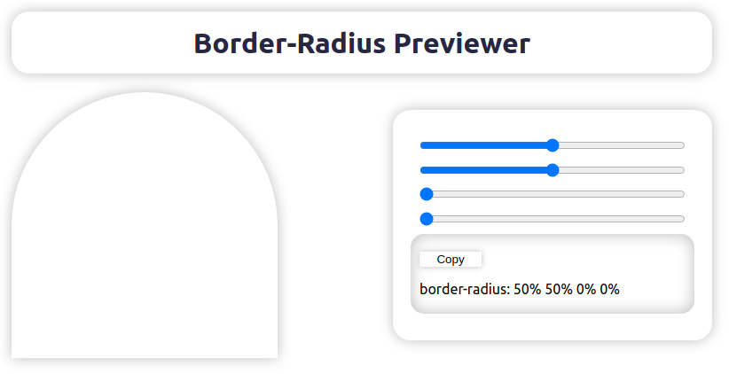

# Border-Radius Previewer

> A simple way to mold complex shapes to your components, without needing to try a different value of broder-radius at each corner of it.

## How Does It Work

 
To create a complex shape, you only need to change the values in the range inputs at the right and see how the component box at the left shapes. 
To use the shape you made, you can click at the "copy" button, to copy the CSS code of the shape.

## How to Use It

Try the Border-Radius Previewer at the link below:  
<a href='https://border-radius-previewer-react-55d1ydoj8-rebastos.vercel.app/'>https://border-radius-previewer-react.vercel.app/</a>
